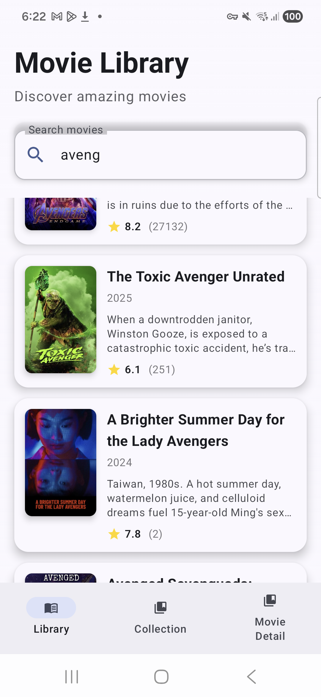
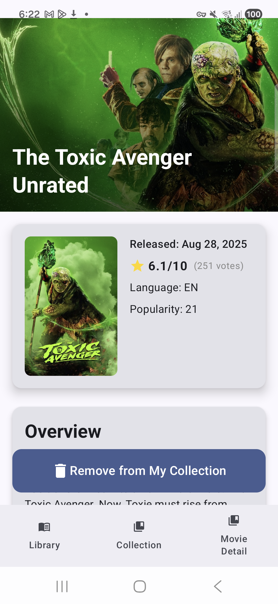
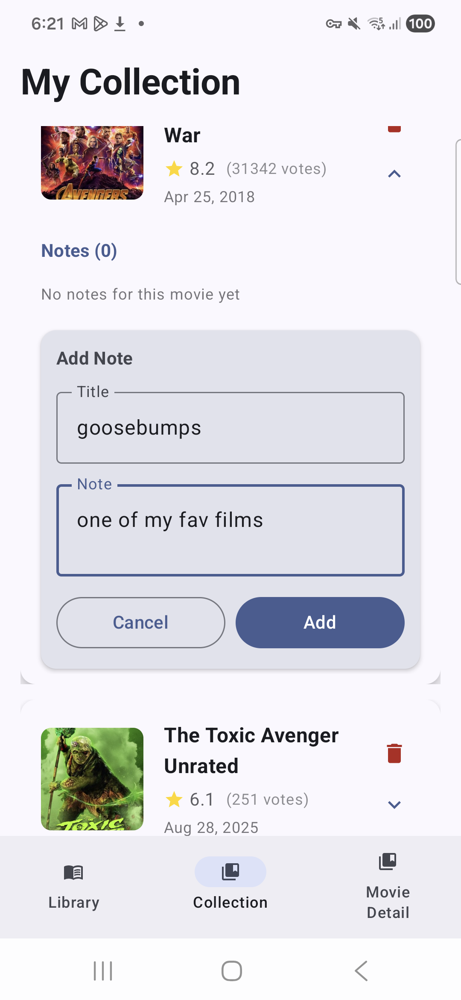

# 🎬 Movie Library - Android Application

A modern Android application built with **Jetpack Compose** that allows users to search for movies, view detailed information, save favorites to a personal collection, and add notes. This project demonstrates proficiency in modern Android development practices and architecture patterns.

---

## 📸 Screenshots

<div align="center">
  
  
  
</div>

## 📱 Features

### 🔍 Movie Search & Discovery
- **Real-time Movie Search**: Search movies using The Movie Database (TMDB) API
- **Debounced Search**: Optimized search with 1-second debounce to reduce API calls
- **Search Validation**: Minimum 2 characters required for search queries
- **Animated List**: Smooth slide-in and fade-in animations for movie cards

### 💾 Personal Collection Management
- **Add/Remove Movies**: One-tap to add or remove movies from your collection
- **Persistent Storage**: Movies saved locally using Room Database
- **Collection Screen**: View all saved movies with expandable cards
- **Delete Functionality**: Remove movies from collection with associated notes cleanup

### 📝 Notes System
- **Add Notes**: Create titled notes for each movie in your collection
- **View Notes**: Expandable cards showing all notes for a movie
- **Delete Notes**: Remove individual notes
- **Scrollable Notes**: Efficient scrolling for movies with multiple notes
- **Note Count Display**: Shows number of notes per movie

### 🎨 Modern UI/UX
- **Material 3 Design**: Latest Material Design components and theming
- **Jetpack Compose**: Fully declarative UI with Compose
- **Bottom Navigation**: Easy navigation between Library and Collection screens
- **Animated Transitions**: Smooth animations for card expansion and list items
- **Edge-to-Edge Display**: Modern full-screen experience
- **Responsive Cards**: Elevation, rounded corners, and proper spacing
- **Empty States**: User-friendly messages when collection is empty

---

## 🛠️ Technical Skills Demonstrated

### Architecture & Design Patterns
- **MVVM Architecture**: Clean separation of concerns with ViewModel and UI layers
- **Repository Pattern**: Abstraction layer for data sources (API and Database)
- **Dependency Injection**: Dagger Hilt for dependency management
- **Single Source of Truth**: StateFlow for reactive data management

### Android Jetpack Components
- **Jetpack Compose**: Modern declarative UI toolkit
- **Navigation Component**: Type-safe navigation with Compose Navigation
- **ViewModel**: Lifecycle-aware data management
- **Room Database**: Local data persistence with SQLite
  - Custom migrations (Version 1 to 2)
  - DAOs for database operations
  - Flow-based reactive queries
- **Lifecycle**: Proper lifecycle management with `viewModelScope`
- **Material 3**: Latest Material Design components

### Networking & API Integration
- **Retrofit**: RESTful API client for TMDB API
- **Gson Converter**: JSON serialization/deserialization
- **Bearer Token Authentication**: Secure API authentication
- **Coroutines**: Asynchronous programming with Kotlin Coroutines
- **Flow**: Reactive data streams for API responses
- **Network State Handling**: Loading, success, and error states

### Database & Persistence
- **Room Database**:
  - Two entities: `MovieEntity` and `NotesEntity`
  - Custom DAOs with Flow-based queries
  - Database migrations with fallback strategy
  - Foreign key relationships (notes linked to movies)
  - CRUD operations (Create, Read, Update, Delete)
- **Data Mapping**: Conversion between API models and database entities

### Permissions & Security
- **Internet Permission**: `android.permission.INTERNET`
- **Network State Access**: `android.permission.ACCESS_NETWORK_STATE`
- **Network State Change**: `android.permission.CHANGE_NETWORK_STATE`
- **API Key Management**: Secure storage in `apikey.properties` (excluded from version control)
- **BuildConfig**: Compile-time injection of API keys

### Image Loading
- **Coil**: Modern image loading library for Compose
- **OkHttp Integration**: Network layer for image loading
- **Multiple Image Sizes**: Support for different poster and backdrop sizes
- **Content Scale**: Proper image scaling (Crop, Fit, etc.)
- **Placeholder Handling**: Graceful handling of missing images

### State Management
- **StateFlow**: Reactive state management for UI
- **MutableStateFlow**: Mutable state for ViewModels
- **collectAsState()**: Compose integration for Flow
- **remember**: Composable state management
- **LaunchedEffect**: Side effects in Compose

### Kotlin Features
- **Coroutines**: Async/await pattern with `suspend` functions
- **Flow**: Reactive streams and operators
- **Debounce**: Flow operator for search optimization
- **Extension Functions**: Custom extensions for URL conversion
- **Data Classes**: Immutable data models
- **Sealed Classes**: Type-safe navigation routes
- **Companion Objects**: Factory methods and constants
- **Null Safety**: Proper null handling with `?` and `?.`

### UI/UX Techniques
- **Lazy Lists**: `LazyColumn` for efficient scrolling
- **Animated Visibility**: Smooth show/hide animations
- **Content Animation**: `animateContentSize` for expandable cards
- **Spring Animations**: Natural motion with spring physics
- **Gradient Overlays**: Visual effects for better readability
- **Card Elevation**: Material depth and shadows
- **Responsive Padding**: Proper spacing with `PaddingValues`
- **Text Overflow**: Ellipsis for long text
- **Date Formatting**: Custom date formatters

### Testing & Debugging
- **BuildConfig**: Environment-specific configurations
- **Debug Logging**: Hilt module logging for database creation
- **Error Handling**: Try-catch blocks for API and database operations

### Build Configuration
- **Gradle Kotlin DSL**: Modern build configuration
- **Version Catalogs**: Centralized dependency management (`libs.versions.toml`)
- **Build Variants**: Debug and release configurations
- **ProGuard**: Code obfuscation setup
- **Compose Compiler**: Kotlin compiler plugin for Compose

### Version Control & Best Practices
- **Git Ignore**: Proper exclusion of sensitive files and build artifacts
- **API Key Security**: Separate properties file for secrets
- **Clean Code**: Well-organized package structure
- **Naming Conventions**: Clear and consistent naming

---

## 📦 Tech Stack

| Category | Technologies |
|----------|-------------|
| **Language** | Kotlin 2.2.10 |
| **UI Framework** | Jetpack Compose, Material 3 |
| **Architecture** | MVVM, Repository Pattern |
| **Dependency Injection** | Dagger Hilt 2.56.2 |
| **Networking** | Retrofit 3.0.0, Gson 2.13.1 |
| **Database** | Room 2.7.2 |
| **Image Loading** | Coil 3.3.0 |
| **Async** | Kotlin Coroutines, Flow |
| **Navigation** | Navigation Compose 2.9.3 |
| **Build Tool** | Gradle 8.12.1 |
| **Min SDK** | 24 (Android 7.0) |
| **Target SDK** | 36 (Android 14+) |

---

## 🏗️ Project Structure

```
com.example.comicslibrary/
├── model/
│   ├── api/          # API response models
│   ├── db/           # Database entities and DAOs
│   └── repository/   # Data repositories
├── view/             # Compose UI screens
├── viewmodel/        # ViewModels for business logic
├── ui/theme/         # Material 3 theming
├── HiltModule.kt     # Dependency injection setup
├── MainActivity.kt   # Main entry point
└── MoviesApplication.kt  # Application class
```

---

## 🚀 Key Implementations

### 1. **Dependency Injection with Hilt**
- Application-level module for singleton dependencies
- Provides API repository and Room database instances
- ViewModel injection with `@HiltViewModel`

### 2. **Room Database Migration**
- Custom migration from version 1 to 2
- Handles schema changes with data preservation
- Fallback to destructive migration for development

### 3. **Reactive Data Flow**
- API responses wrapped in `NetworkResult` sealed class
- Flow-based database queries for real-time updates
- StateFlow for UI state management

### 4. **Search Optimization**
- Channel-based input handling
- Debounce operator to reduce API calls
- Query validation before API requests

### 5. **Image URL Handling**
- Extension functions for TMDB image URL construction
- Support for multiple image sizes (small, medium, large)
- Separate handling for posters and backdrops

### 6. **Notes Management**
- One-to-many relationship (Movie to Notes)
- Cascade delete when removing movies
- Expandable UI for note viewing and creation

---

## 🔧 Setup Instructions

1. **Clone the repository**
   ```bash
   git clone repository-url>](https://github.com/mohnish777/MovieLibrary.git
   ```

2. **Get TMDB API Key**
   - Sign up at [The Movie Database](https://www.themoviedb.org/)
   - Generate an API key and access token

3. **Configure API Keys**
   - Create `apikey.properties` in the root directory
   - Add your credentials:
     ```properties
     MOVIE_ACCESS_TOKEN="Bearer YOUR_ACCESS_TOKEN"
     API_KEY="YOUR_API_KEY"
     ```

4. **Build and Run**
   - Open project in Android Studio
   - Sync Gradle dependencies
   - Run on emulator or physical device

---

## 📝 Learning Outcomes

This project demonstrates:
- ✅ Modern Android development with Jetpack Compose
- ✅ Clean architecture and MVVM pattern
- ✅ Dependency injection with Dagger Hilt
- ✅ RESTful API integration with Retrofit
- ✅ Local data persistence with Room
- ✅ Reactive programming with Coroutines and Flow
- ✅ Material Design 3 implementation
- ✅ Navigation and state management
- ✅ Image loading and caching
- ✅ Database migrations and schema management
- ✅ Secure API key management
- ✅ Permission handling
- ✅ UI/UX best practices with animations

---

## 🎯 Future Enhancements

- [ ] Add sharing functionality for movie details
- [ ] Implement push notifications for new releases
- [ ] Add user authentication
- [ ] Implement favorites with categories
- [ ] Add movie trailers and videos
- [ ] Implement offline mode
- [ ] Add unit and UI tests
- [ ] Support for multiple languages
- [ ] Dark/Light theme toggle
- [ ] Export notes to PDF

---

## 👨‍💻 Developer

**Mohnish Chittoory**

This project showcases my skills in modern Android development, demonstrating proficiency in Kotlin, Jetpack Compose, MVVM architecture, dependency injection, API integration, database management, and creating polished user experiences.

---

## 📄 License

This project is for educational and portfolio purposes.

---

## 🙏 Acknowledgments

- [The Movie Database (TMDB)](https://www.themoviedb.org/) for the API
- Android Jetpack team for excellent libraries
- Material Design team for design guidelines
